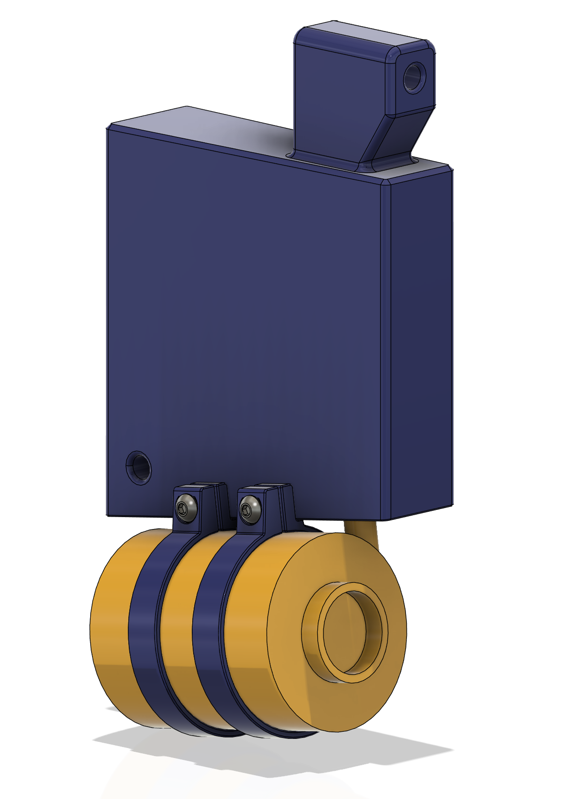

# Active Cooling Block

The Active Cooling Block utilizes the [Flextail Gear Tiny Pump](https://www.aliexpress.com/item/1005006148581215.html) to pump air to the barrel for the active cooling purpose. The block is also serving the purpose of the magazine safety to block the bolt from closing in the chamber. 

## BOM

* 1x Flextail Gear Tiny Pump 2023
* 2x M3x14 or M3x16

